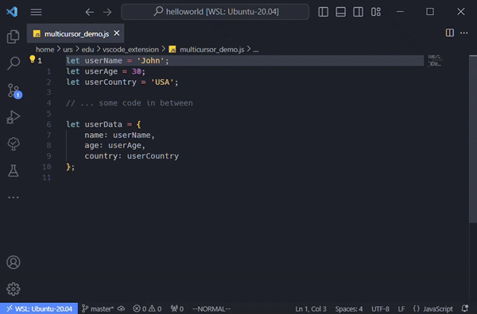

# Vim-Like

> Your first Vim experince. Power of Vim + Ease of Vscode.

Goal of this extension is not 100% vim emulation but to bring in as many features of vim as possible, while maintaining and leveraging behaviour of vscode. Some vim behaviour is tweaked to be more sensible and beginner friendly.

## Some Features

- Switch between **VISUAL** and **INSERT** mode while preserving the selection. This makes things so much easier if you are new to vim.
- Doesn't override standard vscode behaviour. ctrl+c, ctrl+v, ctrl+f etc works as expected.
- Standard multi-cursor support. All vscode methods to place multiple cursors like alt+d, alt+click works as expected with vim motions.
- Special [MultiCursor](#multicursor-mode) mode to place cursors completely via keyboard.
- Registers supported.
- [Surround](#surround-operator) plugin built in. Add replace and delete quotes/brackets around text without hassle. (_XML tags support coming soon.._)

## Modes

Vim-Like provides 4 main modes: **NORMAL**, **INSERT**, **VISUAL**, **VISUAL-LINE**. \
**INSERT** mode is pretty much a vanilla vscode experience.

| From Mode   | To Mode     | Keys                |
| ----------- | ----------- | ------------------- |
| Normal      | Insert      | `i`                 |
| Insert      | Normal      | `jf` (customizable) |
| Normal      | Visual      | `v`                 |
| Visual      | Normal      | `v`                 |
| Visual      | Insert      | `I`                 |
| Insert      | Visual      | `jv` (customizable) |
| Normal      | Visual Line | `V`                 |
| Visual Line | Normal      | `vv`                |

> **Escape** key also switches to Normal mode.

## Operators

Operators are used with motion and text objects as ranges to operate on. **op**{ _num_ }{ **motion**/**text-object** }

| Key  | Action                             |
| ---- | ---------------------------------- |
| `y`  | Yank (copy) Range                  |
| `m`  | Move (cut) Range                   |
| `d`  | Delete Range                       |
| `c`  | Delete Range and enter Insert mode |
| `gu` | Transform Range to lowercase       |
| `gU` | Transform Range to uppercase       |

- Unlike Vim `d` operator does not write to default register

- `m` operator writes to default register. So in _vim-like_ `y` and `m` behaves like standard copy and cut operations and `d` like standard delete.

- Unlike Vim all `m`oved `y`anked text is moved to numbered `(1-9)` history registers.

- All `d`eleted text that is atleast a line long or more is also moved to `(1-9)` registers.

- `0` register always has the last yanked text.

- If named registers are used then text is not written to any other registers.

> Use `p` to paste last yanked/moved text or `"{reg}p` to paste from a [register](#registers)

### <ins>Surround Operator

Add Replace and Delete quotes/brackets around text without hassle. (XML tags support coming soon..)

| Key  | Input 1           | Input 2    | Action                                          |
| ---- | ----------------- | ---------- | ----------------------------------------------- |
| `cs` | _wrapchar_        | _wrapchar_ | Change surrounding _input-1_ with _input-2_     |
| `ds` | _wrapchar_        |            | Delete surrounding _input-1_                    |
| `ys` | motion/textobject | _wrapchar_ | Wrap range returned from _input-1_ by _input-2_ |

> wrapchar = { } ( ) [ ] < > " ' `

## MultiCursor Mode

Add multiple cursors completely via keyboard.

Press `q` to enter **MultiCursor** mode. \
Use motions to navigate and place cursor markers\
Press `q` to exit **MultiCursor** mode. All markrers will be converted to cursors.

| Key         | Action                   |
| ----------- | ------------------------ |
| `a`         | Add cursor marker        |
| `r`         | Remove cursor marker     |
| `t`         | Toggle cursor marker     |
| `c`         | Clear all cursor markers |
| `Tab`       | Go to next marked cursor |
| `Shift+Tab` | Go to prev marked cursor |

## Registers

Registers are like internal clipboards for vim. Select a register `"{reg}` to be used by next operator or paste action.
| Register | Description |
| --------- | ---------------------------------------------------- |
| `"` |Default Register. If no register is selected by user the default register is used.|
| `a-z` |Named Registers. eg. `"x`|
| `0` |Yank Register. Stores the text from last yank.|
| `1-9` |History registers. 1 being most recent and 9 the oldest|
| `*` |System Clipboard Register. To yank/move/paste to and from System Clipboard.|

## Motions

Combine motions with number to repeat them. `{num}motion`

| Keys      | Description                                          |
| --------- | ---------------------------------------------------- |
| `h`       | Move left.                                           |
| `j`       | Move down.                                           |
| `k`       | Move up.                                             |
| `l`       | Move right.                                          |
| `w`       | Next word start (exclusive)                          |
| `W`       | Next WORD start (exclusive)                          |
| `e`       | Next word end                                        |
| `E`       | Next WORD end                                        |
| `b`       | Prev word start                                      |
| `B`       | Prev WORD start                                      |
| `ge`      | Prev word end                                        |
| `gE`      | Prev WORD end                                        |
| `f{char}` | Jump to next occurrence of {char}                    |
| `F{char}` | Jump to previous occurrence of {char}.               |
| `t{char}` | Jump to 1 char before next occurrence of {char}.     |
| `T{char}` | Jump to 1 char before previous occurrence of {char}. |
| `;`       | Repeat last f/F/t/T motion                           |
| `,`       | Repeat last f/F/t/T motion in opposite direction     |
| `/{word}` | Search {word} forward and jump (exclusive)           |
| `?{word}` | Search {word} backward and jump (exclusive)          |
| `n`       | Repeat last word-search motion                       |
| `N`       | Repeat last word-search motion in opposite direction |
| `gg`      | First line of the document.                          |
| `G`       | Last line of the document.                           |
| `}`       | Down a paragraph.                                    |
| `{`       | Up a paragraph.                                      |
| `$`       | End of line.                                         |
| `^`       | First non-white char of line.                        |
| `0`       | Beginning of line.                                   |
| `H`       | Top of screen.                                       |
| `M`       | Middle of screen.                                    |
| `L`       | Bottom of screen.                                    |

## Other Actions

### <ins>VSCode Actions

| Keys          | Description                                                 |
| ------------- | ----------------------------------------------------------- |
| `za`          | Fold toggle                                                 |
| `zc`          | Fold close                                                  |
| `zo`          | Fold open                                                   |
| `z{num}`      | Fold level {num}                                            |
| `gd`          | Goto Definition / Peek Reference                            |
| `t`           | Toggle peek widget focus (when reference editor is visible) |
| `gh`          | Show hover type/error information                           |
| `Space`       | Scroll down (default by 5 lines)                            |
| `Shift+Space` | Scroll up (default by 5 lines)                              |
| `:`           | Show command palette                                        |

###

| Keys | Description                                                                                  |
| ---- | -------------------------------------------------------------------------------------------- |
| `i`  | Switches to insert mode and allows you to edit text right before the current cursor position |
| `I`  | Switches to insert mode and places the cursor at the beginning of the line                   |
| `a`  | Switches to insert mode and allows you to edit text right after the current cursor position  |
| `A`  | Switches to insert mode and places the cursor at the end of the line                         |
| `o`  | Switches to insert mode adding a line below the current one                                  |
| `O`  | Switches to insert mode adding a line above the current one                                  |
| `J`  | Join lines                                                                                   |
| `p`  | Paste yanked text after cursor                                                               |
| `P`  | Paste yanked text before cursor                                                              |
| `u`  | Undo                                                                                         |
| `U`  | Redo                                                                                         |
| `dd` | Delete line under cursor                                                                     |
| `D`  | Delete to the end of the line                                                                |
| `cc` | Delete line under cursor and enter Insert mode                                               |
| `C`  | Delete to the end of the line and enter Insert mode                                          |
| `yy` | Yank line under cursor                                                                       |
| `Y`  | Yank to the end of the line                                                                  |
| `mm` | Move (cut) line under cursor                                                                 |
| `gm` | Move (cut) to the end of line                                                                |
| `x`  | Delete selection                                                                             |
| `s`  | Delete selection and enter Insert mode                                                       |
